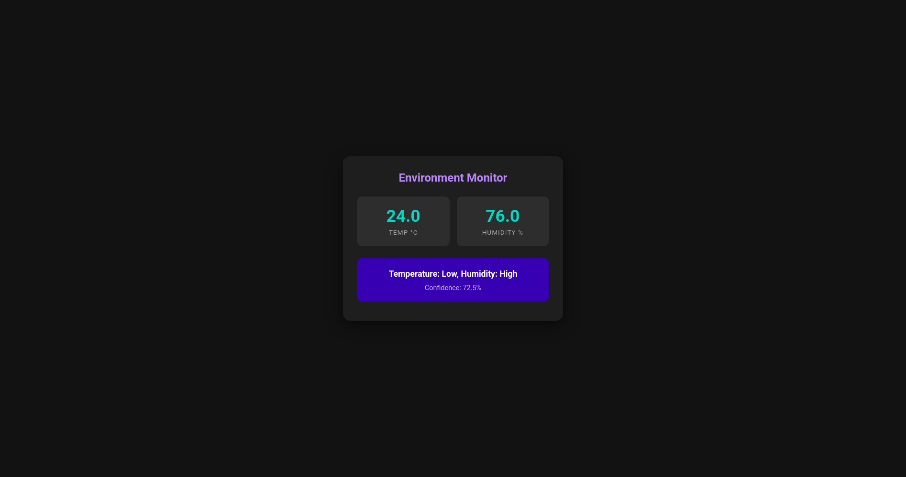

# Hot or Cold TinyML (ESP32-S3)

A TinyML project that reads temperature/humidity from a DHT11 sensor, trains a classifier in Python, and runs inference on an ESP32-S3 with a live web dashboard.

## Project Structure

```
hotOrColdTinyML/
├── data/
│   ├── raw/                # Original collected CSV data
│   └── processed/          # Cleaned data used for training
├── docs/
│   └── hardware/           # Hardware notes/assets
├── firmware/
│   ├── data-collection/    # PlatformIO project to read and stream sensor data
│   └── inference-system/   # PlatformIO project running TinyML + web dashboard
│       └── include/wifi_secrets.h.example
├── models/
│   ├── model.tflite        # Exported TensorFlow Lite model snapshot
│   └── model.h             # C header model snapshot for embedded use
├── notebooks/
│   ├── 01-data-cleaning.ipynb
│   └── 02-training.ipynb
├── requirements.txt
└── README.md
```

## What Each Part Does

- `firmware/data-collection`: prints sensor values over serial for dataset creation.
- `notebooks/01-data-cleaning.ipynb`: cleans and prepares dataset.
- `notebooks/02-training.ipynb`: trains classification model and exports TinyML artifacts.
- `firmware/inference-system`: loads the model and serves real-time predictions at the ESP32 local IP.

## Prerequisites

- Python 3.10+ (3.11 recommended)
- PlatformIO CLI or VS Code + PlatformIO extension
- ESP32-S3 board
- DHT11 sensor /DHT22 sensor /BME680 sensor (optional)

## Python Setup (Data + Training)

```bash
python -m venv .venv
source .venv/bin/activate
pip install -r requirements.txt
```

Then run notebooks in order:
1. `notebooks/01-data-cleaning.ipynb`
2. `notebooks/02-training.ipynb`

## Firmware Setup

### 1) Data Collection Firmware

```bash
cd firmware/data-collection
pio run -t upload
pio device monitor -b 115200
```

Collect serial output and save to CSV for training.

### 2) Inference + Dashboard Firmware

Create local Wi-Fi secrets file:

```bash
cp firmware/inference-system/include/wifi_secrets.h.example \
   firmware/inference-system/include/wifi_secrets.h
```

Edit `firmware/inference-system/include/wifi_secrets.h` with your network credentials, then upload:

```bash
cd firmware/inference-system
pio run -t upload
pio device monitor -b 115200
```

After boot, open the printed IP address in your browser to see live temperature, humidity, and model predictions.

## Dashboard Preview

<p align="center">
  
</p>

## Notes

- `wifi_secrets.h` is git-ignored to avoid committing credentials.
- `models/` stores a snapshot copy. The firmware actually compiles using `firmware/inference-system/include/model.h`.

## Suggested Next Steps

- Add an MIT license (`LICENSE`) for open-source sharing.
- Add a `docs/hardware/wiring.md` diagram with exact ESP32-S3 ↔ DHT11 pins.
- Add a short `CHANGELOG.md` for project milestones.
- Add a small script to convert serial logs directly into `data/raw/` CSV.
